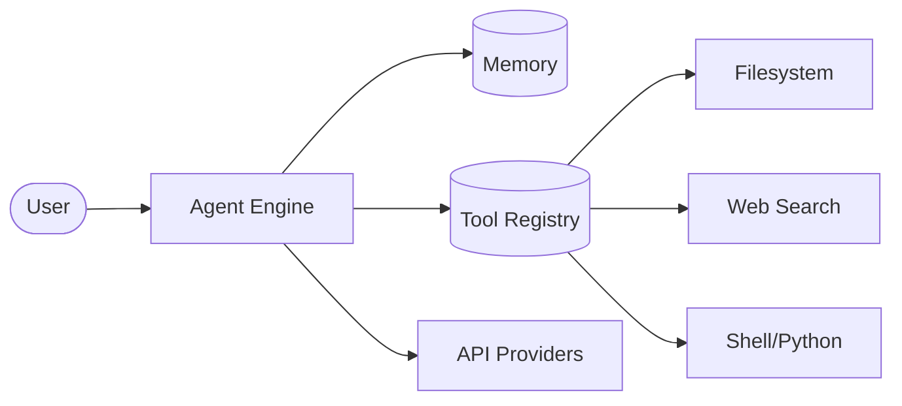

<!-- ===== HEADER ANIMASI ===== -->
<div align="center">
  
</div>

<!-- ===== PEMBUKA ANIMASI ===== -->
<div align="center">
  <a href="https://git.io/typing-svg">
    
  </a>
</div>

<br/>

<!-- ===== TAUTAN SOSIAL MEDIA & KONTAK ===== -->
<div align="center">

[](https://xbibzofficiall.netlify.app)
[](https://github.com/XbibzOfficial777)
[](https://tiktok.com/@xbibzofficiall)
[](https://ko-fi.com/xbibzofficial)
[](https://t.me/xbibzofc)

</div>

<br/>

<!-- ===== JUMLAH KUNJUNGAN ===== -->
<div align="center">
  
  
</div>

---

## 👨‍💻 Tentang Gue

<table>
  <tr>
    <td width="60%">
      <ul>
        <li>Sekarang lagi fokus ngerjain proyek web modern dan tools CLI open-source</li>
        <li>Lagi dalemin teknologi AI/ML, sama arsitektur backend yang scalable</li>
        <li>Terbuka banget buat kolaborasi proyek open source, terutama di ekosistem Python/Node.js</li>
        <li>Mau nanya soal Web Development, JavaScript, Python, atau tools CLI? Gas aja!</li>
        <li>Kontak gue di <a href="mailto:xbibzofficial@protonmail.com"><b>xbibzofficial@gmail.com</b></a></li>
        <li>Fakta acak: Paling semangat ngoding pas tengah malem ditemenin kopi item ☕</li>
      </ul>
    </td>
    <td width="40%">
      
    </td>
  </tr>
</table>

---

## 🚀 Proyek Unggulan: DeepSeek CLI Agent v4.0

<div align="center">
  <a href="https://github.com/XbibzOfficial777/deepseek-cli">
    
  </a>
</div>

**DeepSeek CLI** adalah AI Agent otonom production-grade yang gue desain buat ngakalin workflow development. Dibekali agentic loop canggih, dia gak cuma "ngobrol"—tapi **nalar, rencana, dan eksekusi** tugas pakai 26+ tools bawaan. Pas banget buat developer yang butuh kecepatan, otonomi, dan efisiensi di terminal.

### ✨ Fitur Kunci

| Fitur | Deskripsi |
|---|---|
| **Autonomous Reasoning** | Mesin perencana multi-langkah yang mecah tugas kompleks jadi langkah-langkah yang bisa dieksekusi. |
| **26+ Tools Terintegrasi** | Akses penuh ke Filesystem, Shell, Web Search, Eksekusi Python, dan operasi Git. |
| **Multi-Provider AI** | Dukungan native buat 7 provider AI: OpenRouter, Gemini, Anthropic, Groq, Together AI, HuggingFace, dan OpenAI. |
| **UI/UX Elegan** | Antarmuka terminal kaya dengan real-time streaming, progress tracking, dan syntax highlighting. |
| **Mobile Ready** | Optimal buat Android Termux dan lingkungan low-latency. |
| **Eksekusi Aman** | Validasi perintah bawaan dan mode otonom yang bisa di-toggle buat operasi yang aman. |

### 🔄 Arsitektur Agentic Loop

1. **Perception:** Agen menerima maksud pengguna dan menganalisis lingkungan.
2. **Planning:** Model AI (default DeepSeek-R1) menghasilkan strategi eksekusi multi-langkah.
3. **Action:** Agen memanggil tools khusus (Filesystem, Shell, dll.) buat ngerjain tugas.
4. **Observation:** Hasil dimasukin balik ke memori buat koreksi diri dan perbaikan.



> **Tech Stack:** Python 97.6%, Shell 2.4% &nbsp;|&nbsp; **Lisensi:** MIT &nbsp;|&nbsp; **Status:** Aktif dikembangin

### ⚡ Instalasi Cepat

```bash
bash -c "$(curl -fsSL https://raw.githubusercontent.com/XbibzOfficial777/deepseek-cli/refs/heads/main/install.sh)"
```

---

## 📦 Proyek Lainnya

<div align="center">
  <a href="https://github.com/XbibzOfficial777/ytmusicscraper">
    
  </a>
</div>

---

## 🛠️ Gudang Teknologi

### Bahasa Pemrograman


### Framework & Library


### Database & Backend


### Tools & Platform


### Desain


---

## 📊 Statistik GitHub

<div align="center">
  
  
</div>

<div align="center">
  
</div>

<div align="center">
  
</div>

---

## 🏆 Trofi GitHub

<div align="center">
  
</div>

---

## 🤝 Yuk, Nyambung!

<div align="center">
  <a href="https://xbibzofficiall.netlify.app">
    
  </a>
  <a href="https://github.com/XbibzOfficial777">
    
  </a>
  <a href="https://tiktok.com/@xbibzofficiall">
    
  </a>
  <a href="https://ko-fi.com/xbibzofficial">
    
  </a>
  <a href="https://t.me/xbibzofc">
    
  </a>
</div>

<br/>

<!-- ===== FOOTER ===== -->
<div align="center">
  
</div>

---

<div align="center">
  Dibuat dengan bangga oleh <b>XbibzOfficial777</b> 🚀
</div>
