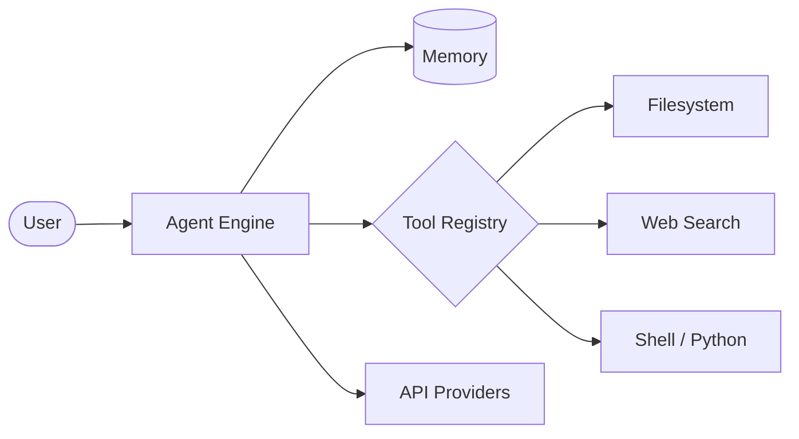

<!-- Header Banner -->
<div align="center">
  
</div>

<div align="center">
  <a href="https://git.io/typing-svg">
    
  </a>
</div>

<br/>

<div align="center">

  [](https://xbibzofficiall.netlify.app)
  [](https://github.com/XbibzOfficial777)
  [](https://tiktok.com/@xbibzofficiall)
  [](https://ko-fi.com/xbibzofficial)
  [](https://t.me/xbibzofc)

</div>

<div align="center">
  
  
</div>

---

## About Me

<table>
  <tr>
    <td width="65%">
      <ul>
        <li>Focused on building modern web applications and open-source CLI tools.</li>
        <li>Currently exploring AI/ML technologies and scalable backend architectures.</li>
        <li>Open to collaboration on open-source projects, especially within the Python and Node.js ecosystems.</li>
        <li>Feel free to reach out regarding Web Development, JavaScript, Python, or CLI tooling.</li>
        <li>Contact: <a href="mailto:xbibzofficial@gmail.com"><strong>xbibzofficial@gmail.com</strong></a></li>
      </ul>
    </td>
    <td width="35%">
      
    </td>
  </tr>
</table>

---

## Featured Project: DeepSeek CLI Agent v4.0

<div align="center">
  <a href="https://github.com/XbibzOfficial777/deepseek-cli">
    
  </a>
</div>

**DeepSeek CLI** is a production-grade autonomous AI agent designed to streamline development workflows. Equipped with an advanced agentic loop, it goes beyond simple chat — it **reasons, plans, and executes** tasks using 26+ built-in tools. Ideal for developers seeking speed, autonomy, and efficiency in the terminal.

### Key Features

| Feature | Description |
|---------|-------------|
| **Autonomous Reasoning** | Multi-step planning engine that decomposes complex tasks into executable actions. |
| **26+ Integrated Tools** | Full access to Filesystem, Shell, Web Search, Python execution, and Git operations. |
| **Multi-Provider AI** | Native support for 7 AI providers: OpenRouter, Gemini, Anthropic, Groq, Together AI, HuggingFace, and OpenAI. |
| **Elegant UI/UX** | Rich terminal interface with real-time streaming, progress tracking, and syntax highlighting. |
| **Mobile Ready** | Optimized for Android Termux and low-latency environments. |
| **Secure Execution** | Built-in command validation and toggleable autonomous mode for safe operations. |

### Agentic Loop Architecture



**Tech Stack:** Python 97.6%, Shell 2.4%  
**License:** MIT  
**Status:** Actively maintained

### Quick Install

```bash
bash -c "$(curl -fsSL https://raw.githubusercontent.com/XbibzOfficial777/deepseek-cli/refs/heads/main/install.sh)"
```

---

## Other Projects

<div align="center">
  <a href="https://github.com/XbibzOfficial777/ytmusicscraper">
    
  </a>
  <a href="https://github.com/XbibzOfficial777/flashdisk-recovery">
    
  </a>
  <a href="https://github.com/XbibzOfficial777/Debian-Installer-Termux">
    
  </a>
  <a href="https://github.com/XbibzOfficial777/obfushtml">
    
  </a>
  <a href="https://github.com/XbibzOfficial777/nexoai">
    
  </a>
</div>

---

## Tech Stack

### Languages


### Frameworks & Libraries


### Databases & Backend


### Tools & Platforms


### Design


---

## GitHub Stats

<div align="center">
  
  
</div>

<div align="center">
  
</div>

<div align="center">
  
</div>

---

## GitHub Trophies

<div align="center">
  
</div>

---

## Connect With Me

<div align="center">
  <a href="https://xbibzofficiall.netlify.app">
    
  </a>
  <a href="https://github.com/XbibzOfficial777">
    
  </a>
  <a href="https://tiktok.com/@xbibzofficiall">
    
  </a>
  <a href="https://ko-fi.com/xbibzofficial">
    
  </a>
  <a href="https://t.me/xbibzofc">
    
  </a>
</div>

<br/>

<!-- Footer -->
<div align="center">
  
</div>

---

<p align="center"><strong>Built with passion by XbibzOfficial777</strong></p>
